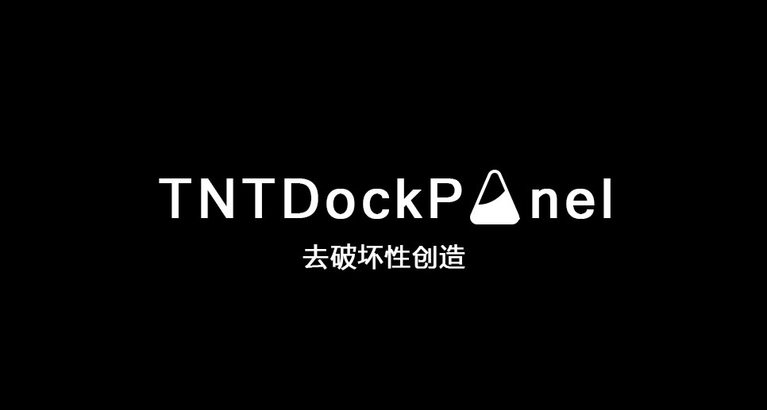

<div align="center">

# TNTDockPanel 🚀
A Docker Management Panel Designed for Modern Developers


[](READMEen.md)

</div>

## 📜 Introduction

TNTDockPanel is more than just a tool - it's a revolution in the Docker world, a tool that transforms the tedious and complex container management into an exciting experience. This intuitive and efficient management platform comes with a clear and friendly graphical interface, making it easy for even Docker beginners to create, monitor, and manage containers. Our carefully designed user interface eliminates the need to remember complex command-line operations, allowing you to complete tasks with just a few clicks.

From configuring container networks and volumes to adjusting environment variables and importing and exporting images, TNTDockPanel makes these operations effortless. We understand that time is precious, so we strive to reduce your workflow and give you maximum satisfaction in the shortest possible time. With TNTDockPanel, you can monitor the real-time status of container runtime, gain直观 insights into resource consumption, and make adjustments quickly when needed.

Our goal is not only to simplify Docker operations, but also to allow every user to experience the charm of technology. Just like TNT after ignition, we hope TNTDockPanel can bring you unprecedented efficiency and excitement in your work. Container technology should be synonymous with innovation and efficiency, and TNTDockPanel is the best embodiment of this concept.

Now, join our user community and experience the revolution brought by TNTDockPanel. We are committed to continuous optimization and update, and we do our best to support the open source community, because we believe that better tools can create a better future. TNTDockPanel, ignite your new way of managing Docker! 🚀🌟

## ✨ Features

- **User-Friendly Interface**: A clear and intuitive user interface helps you manage Docker containers easily.
- **Rapid Deployment**: Deploy applications with just one click, eliminating the need for complex configurations.
- **Real-Time Monitoring**: Real-time updated container status display, providing a clear overview.
- **Cross-Environment Management**: Support multi-environment container management, easily handling various deployment scenarios.
- **Security First**: We value your data security and adopt industry-standard security measures.

---

## ⚙️ Installation

```bash
# Clone the repository
git clone https://github.com/yourusername/TNTDockPanel.git

# Enter the project directory
cd TNTDockPanel

# Start the service using Docker Compose
docker-compose up -d
```

---

## 📖 Usage Guide

This project provides a simple API that allows users to run and create Docker containers by sending JSON data.

### [1. Installation](doc/english/install.md)
### [2. Image Management](doc/english/images.md)
### [3. Container Management](doc/english/containers.md)
### [4. Network Management](doc/english/networks.md)
### [5. Node Management](doc/english/nodes.md)
### [6. Plugin Management](doc/english/plugins.md)
### [7. Service Management](doc/english/services.md)
### [8. Configuration Management](doc/english/configs.md)
### [9. Secret Management](doc/english/secrets.md)

---

## 📝 TODO List

- [ ] Improve container management functionality
  - [ ] Implement quick restart of containers
  - [ ] Add pause and resume functionality for containers
  - [ ] Develop a container log download feature

- [ ] Improve user interface
  - [ ] Optimize mobile view
  - [ ] Refresh the interface style and add theme switching function
  - [ ] User-defined layout and preference settings

- [ ] Extend monitoring functionality
  - [ ] Integrate historical data charts for resource usage
  - [ ] Add alert notification system for resource usage exceeding thresholds or service downtime

- [ ] Enhance system security
  - [ ] Implement multi-factor authentication
  - [ ] Regularly scan containers and images for security vulnerabilities

- [ ] Documentation and community support
  - [ ] Release more sample applications and case studies
  - [ ] Open a developer forum for technical support and community communication
  - [ ] Establish a contributor recognition and incentive mechanism

- [ ] Internationalization and localization
  - [ ] Add multi-language support, covering at least 5 major languages
  - [ ] Adapt the interface for different regional cultures

- [ ] Optimize the installation and configuration process
  - [ ] Simplify the installation process for faster installation and setup
  - [ ] Develop a graphical installation wizard to guide users through the configuration process step by step

- [ ] Develop API and plugin system
  - [ ] Design and implement an open API for easy integration with external applications
  - [ ] Create a plugin market to encourage developers to contribute and share plugins

- [ ] Complete the project roadmap
  - [ ] Develop and publicly release a detailed product roadmap
  - [ ] Regularly update the roadmap based on user feedback and market changes
---

## 👍 Contribution

If you want to contribute to the TNTDockPanel project, please read the [`CONTRIBUTING.md`](doc/chinese/CONTRIBUTING.md) file for more information.

---
## 💞 Donate

If you consider supporting the TNTDockPanel project, our entire development team would be extremely grateful. Your donation will help us continue to advance the development of open source projects. As a token of our appreciation, we will feature your logo in our open source donor directory. After making a donation, please contact us by email so that we can make the necessary arrangements. For more information about donating, please refer to the [`DONATION.md`](doc/DONATION.md) file for detailed instructions.

<div align="center">
  <div style="display: inline-block; margin: 0 10px;">
    
    <p>PayPal Donation QR Code</p>
  </div>
  <div style="display: inline-block; margin: 0 10px;">
    
    <p>Alipay Donation QR Code</p>
  </div>
  <div style="display: inline-block; margin: 0 10px;">
    
    <p>WeChat Pay Donation QR Code</p>
  </div>
</div>

---

## ©️ License

This project follows the MIT License. For more information, please refer to the [`LICENSE`](LICENSE) file.

---